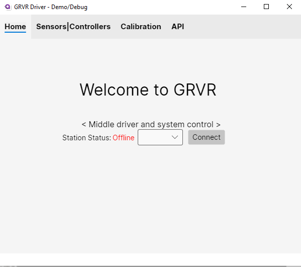
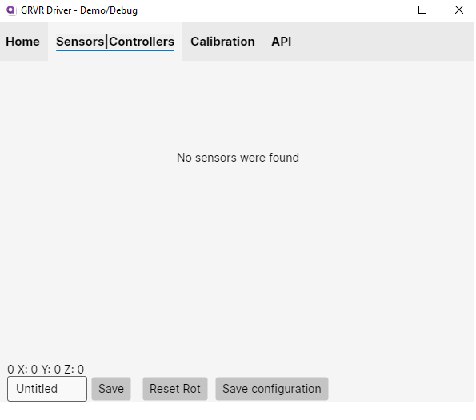
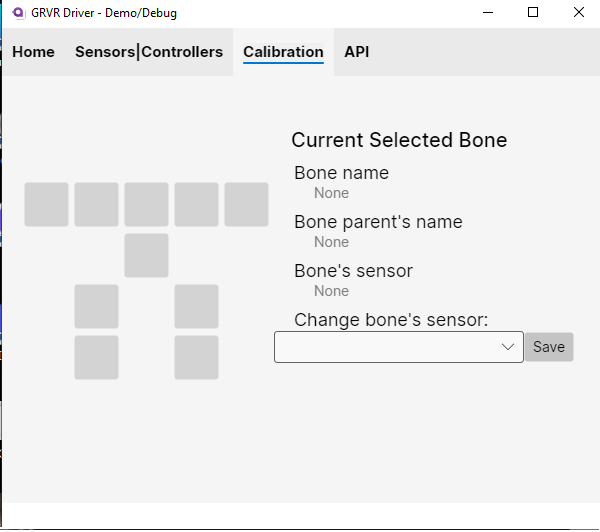
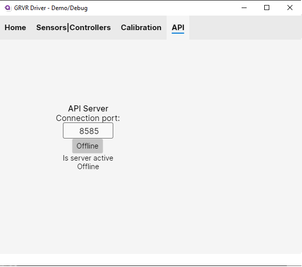
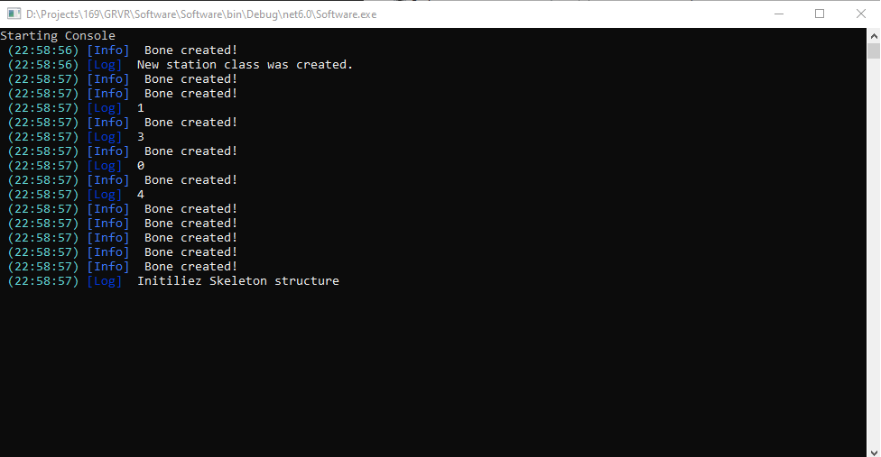

  <h1>Gyroscope Tracking (in) Virtual Reality</h1>

<h3>This project allows you to track points in 3d invieroment using gyroscopes.</h3>

<h4>This gives you the ability you to track your body. Uses can be found in VR Gaming, AR interfaces, sport and physical tracking, Location estimation
</h4>

 
<h2>Current State:</h2>

- [X] Point localization algorithm 
- [X] API implementation
- [X] Custom json file on configuration
- [X] ESP-NOW Communication
- [ ] Controllers
- [ ] Movement algorithm
- [ ] Headset display

<h2> Tech Stack </h2>

||Hardware|Software|Additional|
|:---:|:---:|:---:|:---:|
||ESP8266|AvaloniaUI|SteamVR|
||MPU6050| |Panda3d|
||C++| C#| C++ & Python|

## Documentation

[Documentation](https://github.com/eGuardianDev/GRVR/wiki)

## Limitations
#### 1. Many sensors are needed to track every main point of the body.
#### 2. Every point should have a "parent" point. (Except point zero)

## Pictures

